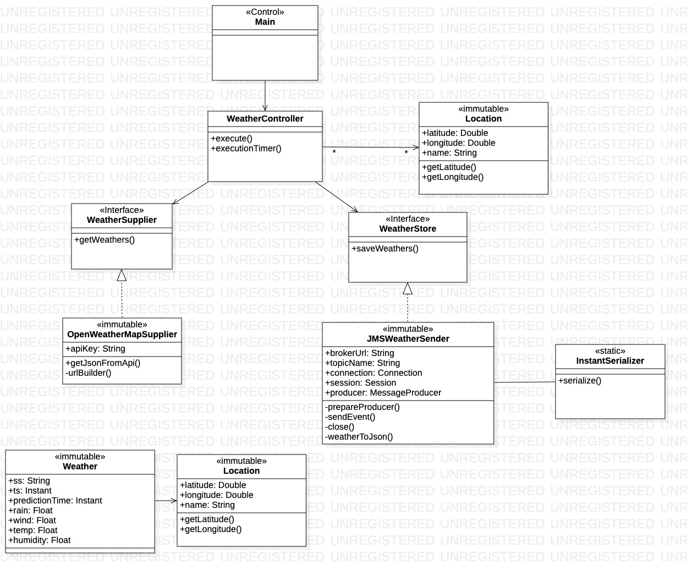
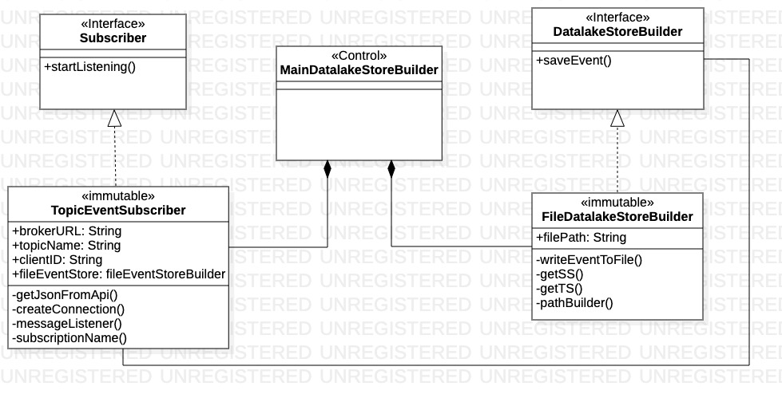
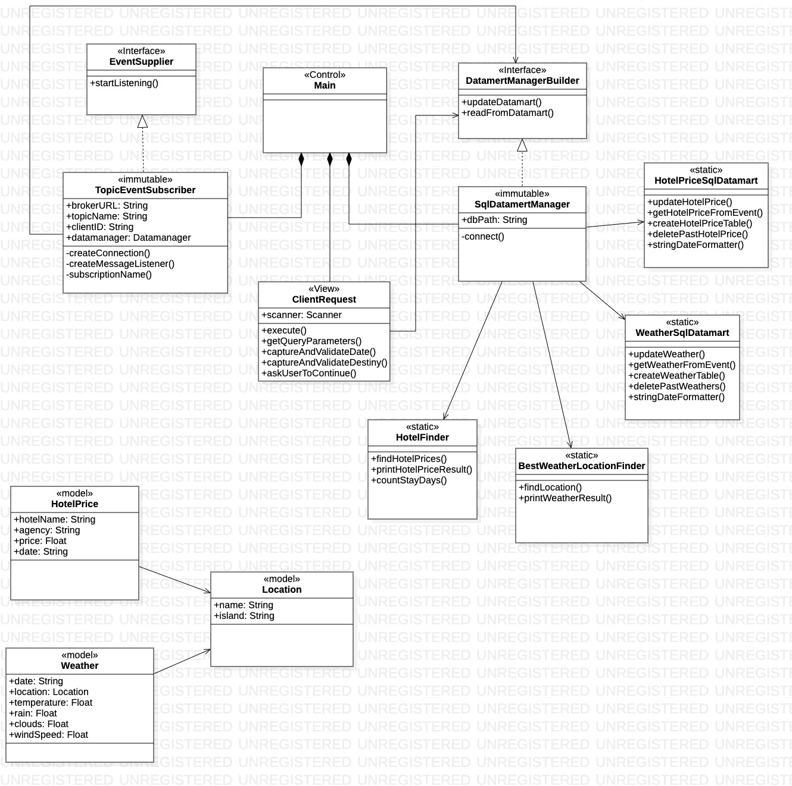

# Proyecto Final: Canary Travel Planner
##### Universidad de las Palmas de Gran Canaria
##### Curso 2023/2024
##### Asignatura: Desarrollo de Aplicaciones para Ciencias de Datos
##### Farid Sánchez Belmadi

***

### Summary of functionality

This Java application is designed to retrieve meteorological data from the eight Canary Islands and store them in a directory.
For this purpose, three modules are used: one for data capture (Weather Provider), another for storage (Event Store Builder), and a broker
that serves as an intermediary, managing the transmission of events between the preceding modules

****

### Resources used

This program has been developed through a Maven project in the IntelliJ IDEA development environment. Additionally, Git version
control tool and its web repository, GitHub, have been used to ensure the persistence of all modifications made.

ActiveMQ was used as a broker, an open-source message broker that implements the Java Message Service (JMS) API, providing a
reliable and scalable messaging solution. It supports various messaging patterns, including point-to-point and publish/subscribe,
and it enables the exchange of messages between different components in a decoupled manner.

On the following page, you will find the getting started guide and installation documentation for ActiveMQ, https://activemq.apache.org/getting-started

****

### Weather Prediction Provider
#### Class diagram

#### Execution of the program

****

### Hotel Price Provider
#### Class diagram

#### Execution of the program

****

### Data-Lake Builder
This Java application will systematically store consumed events from a broker in a directory. The events will be stored in the following format, **{YYYYMMDD}.events**,
where **YYYYMMDD** is the year-month-day obtained from the event's timestamp in which the events associated with a specific day are stored and **.events** is the fi
#### Class diagram

#### Execution of the program

****

### Best Weather and Hotel-Price Finder
#### Class diagram

#### Execution of the program

